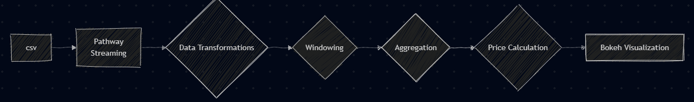
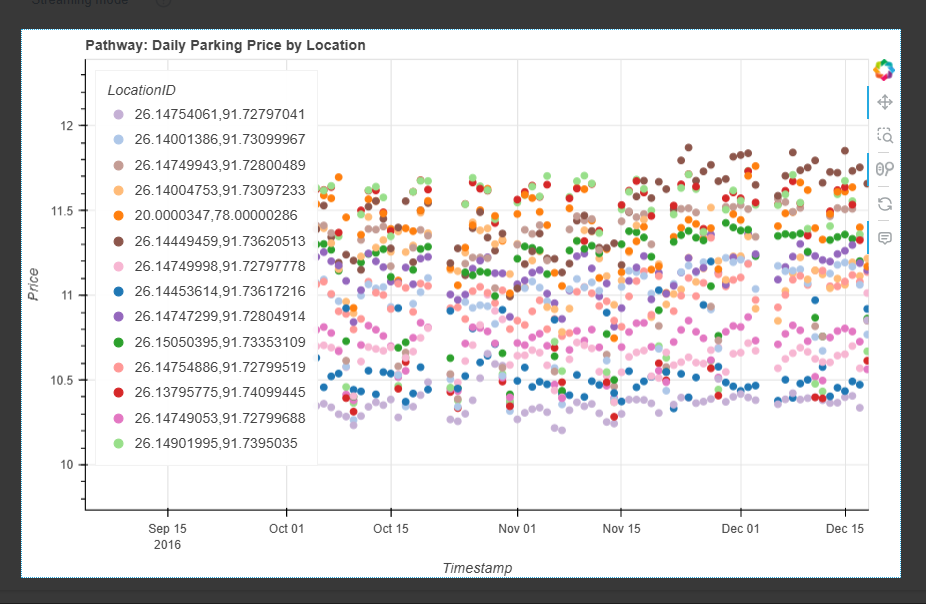
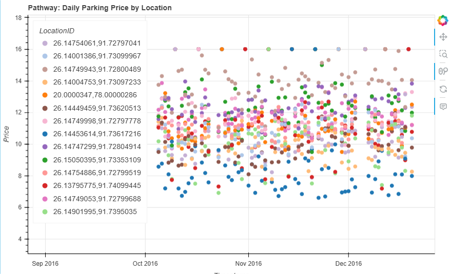

# Real-time Dynamic Parking Pricing with Pathway

This project demonstrates a real-time data processing pipeline using the Pathway framework to implement a dynamic pricing strategy for parking spaces based on live occupancy data. The system ingests streaming parking sensor data, calculates the average occupancy for each location over time, and dynamically adjusts parking prices daily according to a simple demand-responsive model. The results are visualized in real-time using Panel and Bokeh.

## Project Overview

The core idea is to react to real-time parking occupancy data. As parking locations become more occupied, indicating higher demand, the price for parking at that location increases. Conversely, as occupancy decreases, the price decreases. This dynamic pricing aims to balance demand and availability and potentially optimize revenue.

The pipeline leverages Pathway's ability to process data streams and maintain live, updating tables, making it suitable for real-time applications like this.

## Tech Stack

*   **Python:** The primary programming language.
*   **Pathway:** Framework for building real-time data processing pipelines on streaming data.
*   **Pandas:** Used for initial data loading and preprocessing of the historical dataset.
*   **Bokeh:** Interactive visualization library.

## Running the Project

1.  **Base Model:**
    * 

1.  **Bit Advance Model:**
    * 

## Architecture Diagram

**Explanation of the Flow:**

1.  **Input Data (CSV):** The historical parking dataset in CSV format.
2.  **Pathway Replay:** Simulates a real-time stream by replaying the historical CSV data at a controlled rate.
3.  **Pathway Pipeline:** Pathway's core engine processes the streaming data.
4.  **Data Transformations:** Initial steps like parsing timestamps and creating unique location identifiers.
5.  **Windowing (Daily by Location):** The data is grouped by parking location and processed in fixed daily time windows.
6.  **Aggregation (Average Occupancy):** Within each daily window for each location, the average occupancy ratio (Occupancy / Capacity) is calculated.
7.  **Price Calculation:** A dynamic price is computed based on the calculated average occupancy ratio (higher occupancy means higher price).
8.  **Dynamic Price Table (Pathway):** Pathway maintains a live, updating table containing the latest calculated dynamic prices for each location and time window.
9.  **Bokeh Visualization:** A web application built with Panel and Bokeh connects to the live Pathway table to display the price changes over time as they are computed.

## Detailed Architecture and Workflow

1.  **Data Import and Preprocessing:**
    *   The project starts by loading a historical parking dataset (`dataset.csv`) using Pandas.
    *   Crucially, the `LastUpdatedDate` and `LastUpdatedTime` columns are combined and parsed into a single `Timestamp` datetime object.
    *   `Latitude` and `Longitude` are combined into a unique `LocationID` string to easily identify different parking areas.
    *   Only the essential columns (`Timestamp`, `Occupancy`, `Capacity`, `LocationID`) are selected and saved to a new CSV file (`parking_stream.csv`). This file serves as the source for the simulated real-time stream.

2.  **Pathway Data Ingestion:**
    *   Pathway's `pw.demo.replay_csv` function is used to ingest data from `parking_stream.csv`.
    *   A `pw.Schema` (`ParkingSchema`) is defined to specify the expected data types for the incoming stream.
    *   The `input_rate` parameter controls how quickly data rows are ingested, simulating a real-time feed (e.g., `input_rate=1000` attempts to process 1000 records per second).

3.  **Pathway Data Processing Pipeline:**
    *   The raw stream is transformed:
        *   The `Timestamp` string is parsed into a proper datetime column `t`.
        *   The `occ_ratio` (Occupancy / Capacity) is calculated, representing how full the parking location is.
    *   **Windowing:** The data stream is partitioned (`windowby`) by `LocationID`. For each location, data is collected into non-overlapping 24-hour "tumbling windows". This means that once a 24-hour period ends for a specific location, Pathway computes a result for that period and then starts collecting data for the next 24-hour window. `exactly_once_behavior` ensures that each record is processed exactly once within its appropriate window.
    *   **Aggregation:** Within each window (for each location and each day), the average of the `occ_ratio` is calculated using `pw.reducers.avg`.
    *   **Dynamic Pricing:** A simple dynamic pricing formula is applied: `price = BASE_PRICE + ALPHA * avg_occ_ratio`. This model linearly increases the price as the average occupancy ratio increases during the day. `BASE_PRICE` and `ALPHA` are configurable parameters.
    *   The result of this pipeline is a live Pathway table called `daily_price`, which updates automatically as new daily windows are completed and prices are recalculated.

4.  **Real-time Visualization:**
    *   The project uses the Panel and Bokeh libraries to create a dynamic visualization.
    *   The `daily_price` Pathway table is connected to a Bokeh plot via Panel's reactive capabilities.
    *   A scatter plot is generated showing the calculated `price` over `t` (timestamp), with different parking locations (`LocationID`) distinguished by color.
    *   As Pathway updates the `daily_price` table (daily in this specific model), the Panel/Bokeh plot automatically updates to reflect the new prices.

5.  **Pathway Execution:**
    *   `pw.run()` starts the Pathway engine. It begins ingesting data from the simulated stream and continuously processes it through the defined pipeline, maintaining the live `daily_price` table and feeding updates to the visualization.

# Detailed Architecture and Workflow (Model 2)

This project implements a dynamic pricing strategy in Pathway, evolving from a simple occupancy model to one that considers multiple demand factors.

1.  **Data Ingestion and Schema Definition:**
    *   The pipeline begins by defining a `Pathway Schema` (`ParkingSchema`) that includes columns for `Timestamp`, `Occupancy`, `Capacity`, `LocationID`, `TrafficConditionNearby`, `QueueLength`, `IsSpecialDay`, and `VehicleType`. The schema assumes these columns are available in the input stream, with `TrafficConditionNearby`, `QueueLength`, `IsSpecialDay`, and `VehicleType` being numeric (float) types, potentially requiring prior conversion if the raw data contains strings (as might be the case for `TrafficConditionNearby` and `VehicleType`).
    *   The historical `parking_stream.csv` file is loaded and processed as a simulated real-time stream using `pw.demo.replay_csv`. The `input_rate` parameter simulates the arrival speed of data.

2.  **Initial Data Transformations:**
    *   The raw data stream (`data`) is transformed into `data_with_time`.
    *   The string `Timestamp` is parsed into a datetime object `t` using `dt.strptime`.
    *   The `occ_ratio` is calculated as `Occupancy / Capacity`.
    *   Columns `TrafficConditionNearby` and `VehicleType` are directly included in the transformed table under new names `traffic` and `vehicle_weight` (assuming they are already numeric inputs as per the schema).

3.  **Windowing and Aggregation:**
    *   The core logic for price calculation operates on aggregates over time. The `windowby` operation partitions the data stream by `LocationID`.
    *   For each location, `pw.temporal.tumbling(datetime.timedelta(days=1))` creates non-overlapping 24-hour windows. As each window completes, the data within it is processed.
    *   The `reduce` operation aggregates the data within each window:
        *   `t`: The end time of the window.
        *   `LocationID`: The grouping key.
        *   `window_start`: The start time of the window (minimum timestamp).
        *   `avg_occ_ratio`: Average occupancy ratio for the window.
        *   `avg_queue_length`: Average queue length for the window.
        *   `avg_traffic`: Maximum traffic condition value within the window (assuming higher value means less congestion or a representation that decreases price).
        *   `avg_vehicle_weight`: Average vehicle type value within the window (assuming a mapping of vehicle type to a numeric weight).
        *   `is_special_day`: Maximum value of the `IsSpecialDay` flag (1 if any record in the window is a special day).

4.  **Dynamic Price Calculation via UDF:**
    *   A Python function `compute_clamped_price` is defined and decorated with `@pw.udf`. This makes it callable from the Pathway pipeline and ensures it's executed efficiently on the streaming data.
    *   This UDF takes the aggregated features (`avg_occ_ratio`, `avg_queue_length`, `avg_traffic`, `is_special_day`, `avg_vehicle_weight`) as input.
    *   Inside the UDF, a demand value is calculated using a weighted linear combination of these inputs and predefined constants (ALPHA, BETA, GAMMA, DELTA, EPSILON). Note that `avg_traffic` is given a negative weight (GAMMA) assuming that higher traffic nearby makes the parking less attractive or accessible, thus reducing demand and price.
    *   The raw price is then calculated based on a `BASE_PRICE` multiplied by a factor that depends on a scaled version of the demand (`LAMBDA * NormalizedDemand`).
    *   Finally, the calculated `raw` price is clamped using `min(max(raw, 5), 16)` to ensure the output price stays within a defined minimum (5) and maximum (16) value, preventing extreme price fluctuations.
    *   This `compute_clamped_price` UDF is called within a `with_columns` step on the aggregated table, adding a `price` column containing the calculated dynamic price for each daily window.

5.  **Real-time Visualization:**
    *   The resulting `daily_price` Pathway table, which contains the live, updating dynamic prices for each location and day, is connected to a Bokeh plot via Panel.
    *   The `price_plotter` function creates a scatter plot showing `price` over time (`t`), with points colored by `LocationID`.
    *   As Pathway processes incoming data and completes new daily windows, the `daily_price` table updates, and the Panel/Bokeh visualization automatically refreshes to show the new price points.

6.  **Pathway Execution:**
    *   Calling `pw.run()` starts the Pathway engine. It manages the data flow from the simulated stream, processes the data through the windowing, aggregation, and UDF steps, maintains the live price table, and continuously pushes updates to the connected Panel/Bokeh visualization.

# Visualization Plots
1. BASE MODEL PLOT

1. MODEL 2 PLOT 
